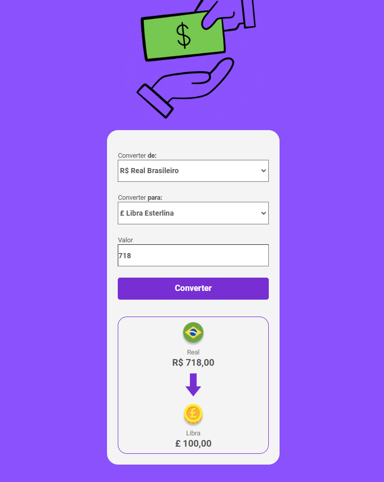
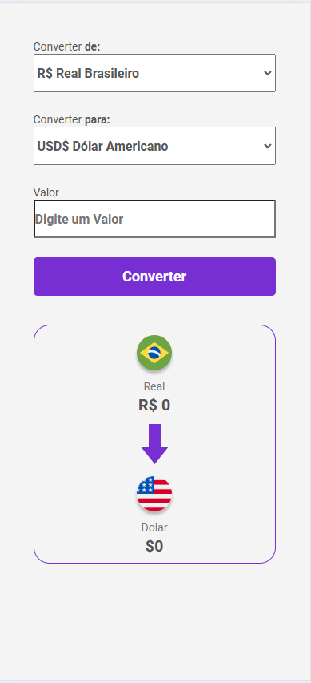

# conversor-de-moedas
<h1>Conversor de Moedas entre Real, Euro, Dólar e Libra</h1>

<h2>Projeto desenvolvido durante minha jornada de aprendizado em JavaScript</h2>

<h2>Principais tecnologias utilizadas</h2>
<ul>
    <li>HTML</li>
    <li>CSS</li>
    <li>JavaScript</li>
</ul>

Este projeto converte as principais moedas em circulação de maneira simplificada. Utiliza a AwesomeApi para pegar as informações da moeda e o valor de câmbio e transformar em objeto. A operação é feita primeiro para real (pré-definido como padrão) e, em seguida, para as demais moedas, tornando-o um conversor bidirecional.

<a href="https://atillarodrigues.github.io/conversor-de-moedas/" target="_blank" >Clique para ser redirecionado para o site</a>

<h3>Este é um projeto responsivo. No computador, ele deve apresentar o seguinte design:</h3>

<h3>No celular, ele deve se adaptar para o design abaixo:</h3>
